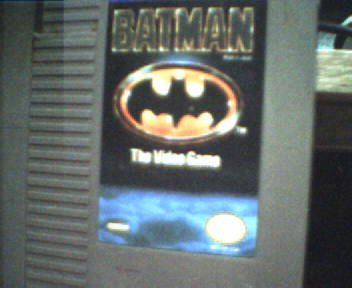
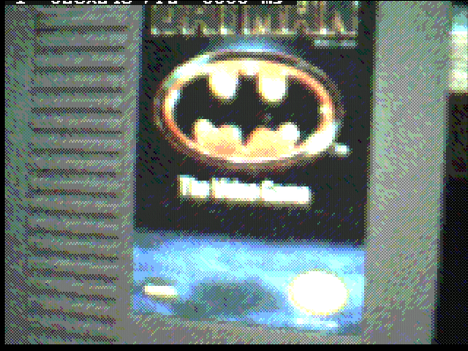
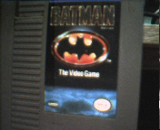
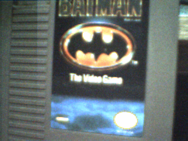
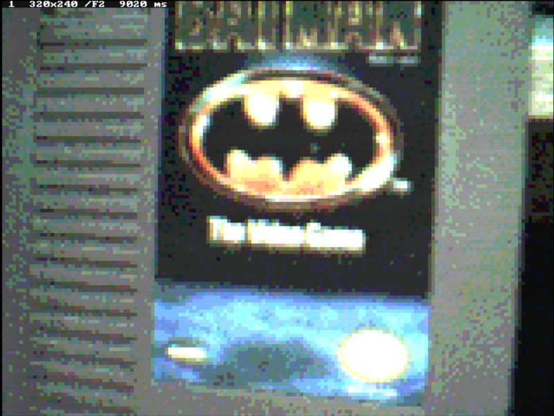
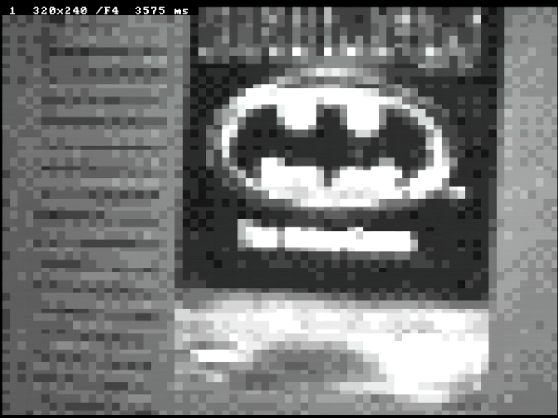
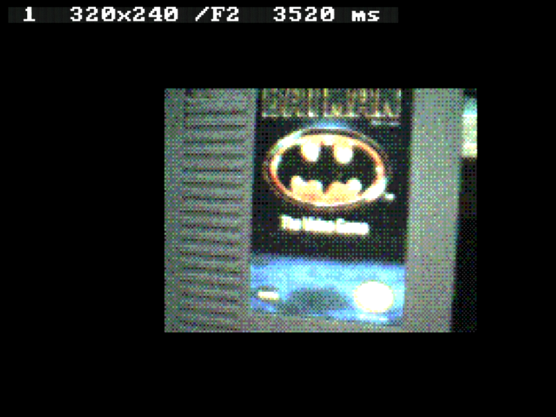
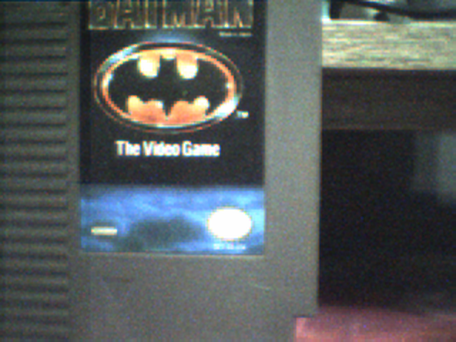
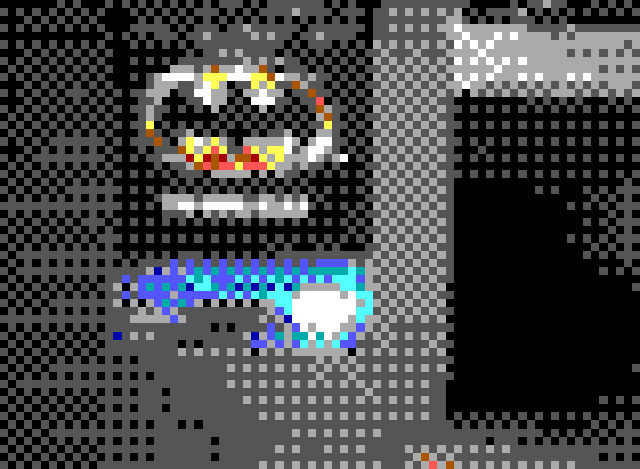

# CH375Camera

**A 1998 USB webcam, taking photographs for an 8086 running MS-DOS.**

An IBM PC Camera -- a Xirlink C-It inside, `0545:8080` -- plugged into a WCH
CH375 on an 8-bit ISA card, driven from real-mode DOS. It takes colour
stills at every resolution the camera has, shows them on the DOS screen in
any of eight display modes from 640x480 down to ASCII, and saves them as
BMP files.

It should not work. The camera streams video *isochronously* at about
225 KB/s, the CH375 has no isochronous mode, holds 64 bytes at a time, and
this machine can drain it at about 16 KB/s. `CH375Audio` measured the same
wall from the other side and concluded that isochronous streams were out of
reach. For an isochronous **IN** endpoint that turned out to be wrong, and
what made the rest possible was the camera's own FIFO and its window
registers, all measured here rather than taken from anywhere. How is below.

One of the projects in [CH375USBTools](../README.md).

| | |
|---|---|
|  |  |
| `CAMSNAP /M=352` -- the whole sensor, 2.2 s, saved as-is | `CAMLIVE` in mode X, photographed off the real screen |

## Which cameras

**One: the IBM PC Camera, `0545:8080` with `bcdDevice 030A` -- Xirlink's
C-It chip, "model 2" in Linux's driver.** The tools check for it and refuse
anything else by name. This is a driver for one camera, not yet a generic
one, and the reason is worth knowing before trying another: the tricks that
made this camera work are the camera's own.

What is **specific to this camera**:

* **Its packet size is a register.** The streaming endpoint says 1022
  bytes, but the camera lets the host set its maximum packet (`0106`/`0107`),
  so it can be made to fit the CH375's 64-byte buffer. A camera whose
  smallest packet is larger than 64 bytes cannot be read by a CH375 at all.
* **It has a window.** Registers `0102`-`0105` pick which part of the sensor
  it sends, which is how a whole strip arrives in one frame. Without one,
  only scattered fragments of each frame get through.
* Its register protocol and start sequence, its frame headers, its pixel
  formats (Bayer, and a YUV layout of its own), and its button.

What is **generic**, and would carry to another camera:

* **Isochronous IN on a CH375 works** -- for any device whose packets fit in
  64 bytes. `CH375Audio`'s "impossible" was about OUT.
* The assembly packet loop, telling blanking from the gaps between lines,
  assembling a frame by length, strips as a technique.
* Everything after the picture is in memory: the displays, the assembly
  drawing, BMP, ASCII and ANSI output.

**The chances with other cameras:**

| | | |
|---|---|---|
| other Xirlink / IBM models -- `0545:8080` models 0, 1 and 3, the IBM NetCamera `0545:8002`, the Veo `800C`/`800D` | **good** | the same chip family; Linux's `gspca/xirlink_cit` has their start sequences, so it is porting and measuring |
| "dual-mode" and still digital cameras that store pictures -- USB Still Image class, PTP | **good**, and the most promising way to generic | they hand over stored JPEGs by *bulk* transfer, which a CH375 does well, with no race against the sensor; decoding JPEG on an 8086 is the slow part |
| other old full-speed webcams with a vendor protocol | case by case | needs a streaming setting with packets of 64 bytes or less (or a register to make one), a way to cut the data per frame, and a known protocol |
| modern UVC webcams | **poor** | usually high-speed devices with a poor full-speed fallback, smallest streaming packets over 64 bytes, often MJPEG only, and no standard crop control to take strips with |

**[NEXT.md](NEXT.md) is the handover note for adding a camera** -- the
order to do it in, the hazards, and which parts of the code are
camera-specific.

**Trying another camera starts with `USBINFO`** from `CH375USBTOOLS`: if no
alternate setting of its streaming interface has a maximum packet of 64
bytes or less, and nothing is known that can change that, it will not
stream through a CH375.

**Making it generic** means splitting a camera driver out of the code:
`camgrab`'s packet engine and strip assembly, `camdisp`, `camfast` and
`camfile` are already camera-independent; what each camera family would
supply is identification and its start and stop, packet-size control,
window control, frame header layout, pixel format, and button -- today
`cit.pas` and the mode table at the top of `camgrab.pas`.

## The tools

| | |
|---|---|
| `CAMSNAP.EXE` | **Take a photograph.** 176x144, 320x240 or 352x288; writes a 24-bit colour (or 8-bit grey) `.BMP` and the camera's own bytes as `.RAW`, and with `/A` ASCII (`.TXT`) and ANSI (`.ANS`) art |
| `CAMLIVE.EXE` | **The picture on the screen, over and over.** Eight display modes, colour or grey, three detail levels. `S` or **the camera's button** saves, `C` colour/grey, `Q` stops |
| `CAMBTN.EXE` | The camera's button: counts presses, with beeps to say when; also prints any other register that changes. `/V` with the camera streaming |
| `CAMPROBE.EXE` | The first experiment: raw isochronous IN at the camera, with a status tally and hex dumps. Kept because it is the tool that shows the transport works |
| `CAMCAL.EXE` | Records the raw stream with the fast packet loop, for working out what the camera sends. `rawcal.py` reads it |
| `FASTTEST.EXE` | Checks every assembly routine in `camfast.pas` against the Pascal it replaced, byte for byte, on the machine itself, and times them |

Every tool prints its help with `/?`. Sources are in `src\`, binaries in
`bin\`, and `build.cmd` builds them all (it needs Free Pascal's i8086-msdos
cross compiler and `..\CH375USBTOOLS\src\ch375.pas`).

## Quick start

    CAMSNAP                      a 320x240 colour photo: SNAP.BMP, SNAP.RAW
    CAMSNAP /M=352 /O=CART       the whole sensor, as CART.BMP
    CAMLIVE                      pictures on the screen until Q or 5 minutes
    CAMLIVE /D=T50               the same in 80x50 text -- faster, and mono-safe
    CAMLIVE /D=ASCII /N=1 /A     one picture, printed to stdout as ASCII art
    CAMSNAP /A                   the photo as SNAP.TXT (ASCII) and SNAP.ANS (ANSI) too

From the Windows side of DOSBridge: `build.cmd snap`, `build.cmd live`,
`build.cmd ascii`.

The picture is taken in strips, one camera frame each, so **the scene has to
keep still for a second or two**. These are photographs, not video -- see
"Why not video" below.

## Testing it

`bin\CAMTEST.BAT` runs every test there is, in order, and prints PASS, FAIL
or SKIP for each, with a summary line at the end:

1. `FASTTEST` -- the assembly against the Pascal it replaced
2. a still in each of the three camera modes (`CT176.BMP`, `CT320.BMP`,
   `CT352.BMP`, left behind to look at)
3. the camera's button -- beeps, then counts presses
4. every display, one picture each (VESA is a SKIP on a boot without it)
5. the button saving a picture from the live view

    CAMTEST          all of it, in the directory with the CAM*.EXE files
    CAMTEST AUTO     without the two button tests

**Nothing in it waits for a key.** The button tests beep when it is time to
press and give up after 20 seconds; with nobody there they report `NOT
PRESSED`, which is not a failure. From the Windows side, `build.cmd
alltests` copies everything to `C:\WORK\CAM` on the box and runs `CAMTEST
AUTO` there.

Run through DOSBridge by hand, it has to be `COMMAND /C CAMTEST`, not the
batch file by name: a batch named in a batch never returns to the one that
named it, so the result is never sent, and a batch file's output ignores
redirection, so `CALL CAMTEST` came back empty. And it keeps no environment
variables, because a DOSBridge job's environment is too small for them --
every `SET` in the first version failed with "Out of environment space".

## What it can do, measured

The camera's native modes -- all it has, from the register sets Linux's
`gspca/xirlink_cit` driver carries:

| `/M=` | picture | format | strips | time to take |
|---|---|---|---|---|
| `176` | 176x144 | YUV 4:2:0 ("YYVYUY") -- the whole sensor scaled by half | 3 | **1.5 s** |
| `320` | 320x240 | Bayer GRBG, 8-bit -- the middle of the sensor | 5 | **1.7 s** |
| `352` | 352x288 | Bayer GRBG, 8-bit -- the whole sensor | 6 | **2.2 s** |

 

`CAMLIVE`'s displays, taking and drawing one picture on the development
machine (an NEC V30):

| `/D=` | screen | 320x240 picture | notes |
|---|---|---|---|
| `VESA` | 640x480x256 | **5.0 s** colour; 8.0 s for 352x288 | only on boots when the card offers mode 101h; see below |
| `X` | 320x240x256 | **5.0 s** colour (`/F=2`); 7.4 s at `/F=1` | mode X -- on every VGA, exactly the camera's size |
| `13` | 320x200x256 | 3.5 s | mode 13h; the picture does not fit, so it is drawn at half size |
| `12` | 640x480x16 | 5.4 s | 16 greys, planar |
| `T50` | 80x50 text | 3.4 s | half-block cells, so 80x100 "pixels" in 16 greys |
| `T25` | 80x25 text | 3.0 s | 80x50; works on a mono card |
| `ASCII` | 80x50 characters | 2.8 s | brightness as `" .:-=+*#%@"`; `/A` also prints it |

`/F` sets the detail: `1` draws every pixel, `2` every other (the default in
graphics), `4` every fourth. Drawing, not the camera, is most of the time on
this CPU, and `/F` divides it by F squared. `/G` draws grey, `/C` colour;
the text modes default to grey, because 16 greys draw a photograph better
than 16 colours. Where a sample is drawn as a block, it is dithered at
screen resolution; `/R` turns that off for about a second a picture.
`AUTO` picks VESA when this boot has it, otherwise mode X, and 80x25 text
on a mono card.

| | |
|---|---|
|  |  |
| VESA 640x480, `/F=2`, photographed | 80x50 text: half-blocks in 16 greys |
|  | |
| mode 13h, `/F=2`, photographed | |

### ASCII and ANSI art

`CAMSNAP /A` also writes the photograph as text: `name.TXT`, ASCII art
(printed to stdout too, which is how it comes back through DOSBridge), and
`name.ANS`, colour ANSI art in half-blocks -- `TYPE` it with `ANSI.SYS`
loaded, or open it in any ANSI viewer. `CAMLIVE /A` prints the ASCII of its
last picture. Both from one run, straight off the box:

| | |
|---|---|
|  |  |
| `ART.BMP` | `ART.ANS`, drawn from its own escape codes by `ans2png.py` |

`ART.TXT`:

```
   ........... ....:::-:.-:.-...:---+---:::= .-+++++=+++*. ....:=---::.....::::
 .............  .::::::.:-:.-:=-:--:-:---=:-..=++++++++*@+-=++++*-.:---:....:.:
   ........... .::::-::--+=-+=+====-:-=+---:..=+++++++++@@@@@@@@@%%#*##%%%%####
 .............       .:---==++++==-::.:::.:...=++++++++*%@@@%%%%%%%%%%########*
..........:::.    .-#@@%#%%%@@@%##*++=-:......+++++*+++*@@@@@@%%%%%%%%@%%%#####
......:::::::.   :+##+-=@@@%:-+@@@*-=+*-:....:+*++++++++###****#***#*******##**
.........:::::  :-%*....=%%=..:#@@-.::-*-:...:+*******+=.  .   ..... ...  . ...
.....:.:::::::  :-@.............:.....:*#-...:+*******+=....      .
.::::::::--:::  .:--..#@+=++:.-+==%@-.-%@=...:+********=... . .  ..
..::::::::::::  ..:-==#@@%%@*+%%@@@@+%@@#++..:+********=....................
..:.::::::::::  ....::-++++#%##****+=--:.::..:+********=...................
.:::::::-----:   ........:::::::::...........:+********-                .....::
.:::::::::---:    ..#%@@+@@@@@@#@%@@@@-......:+********-                ....:--
....::::::::-:    ..::-=:--====-+++=++:......:+*******+-                ....:--
.:::::::::::-:          .....................:+*******+-                ....:--
:::::::::----:.....................::::::::::-+*******+-                ....::-
.:::::::::::-----==+++**#****#*****###%%%%%%##********+-                    ..:
..::::::::::--++**##%#%%@@%%%%%%%%%%%%@@@@@@@%******+++:
.::::::::-----++++**#%###***##*#%@@@@@@@@@@@@@*++++++++:
:::::::::::----=#%%%##+==----===+**%@@@@@@@@@@**+++++++:
.::::::::::::-==+=====------===+**#%@@@@@@%###++++++++=.
.:::::::::::----=====-=====+++++***##%%%%%#*++++++++++=.
.::::::::::::----------==========+++++++++++++++++++++=.
.::::::::::::------------=========+++++++++++++++==+===.
....:.:::::::::-----------===========++=+++++++=+======.
..::::::::::::-------------=============++=+===========.
.::::::::::::::-------------===========================-:::::::::...........::.
.:::::::::::::--------------=======================+*+====---=------------:::::
....::::::::::--------------=======================****++++==+=========-----:::
```

Each character is the mean of the block of pixels it covers, not one
sample -- the first version sampled, and read as noise -- and the ramp is
` .:-=+*#%@`; a 70-character ramp was tried and read worse. The ANSI art is
two pixels a character in the 16 CGA colours, with a light ordered dither
so a grey subject keeps some shading: CGA has four greys, and without it
the cartridge came out one flat dark grey. `ANSI.SYS` cannot show a bright
colour as a background, so each cell puts the brighter half in the
foreground, choosing the upper or lower half-block to suit.

## How it works

### The transport: isochronous IN does work on a CH375

The camera's video endpoint is `EP 81`, isochronous, 1022-byte packets. The
chip has no isochronous mode and `CH375Audio`'s `DAISO` got 0 of 100 packets
accepted pushing audio at a speaker. But that was **OUT**: the chip sends the
data, then waits for a handshake an isochronous device never sends. An **IN**
is the other shape -- the device's answer to the token *is* the data -- and
the chip takes it exactly as it would a bulk packet, acknowledges it, and the
camera ignores the acknowledgement. `CAMPROBE`'s first run: 3000 tokens, 3000
successes, every packet 64 bytes, the first starting with the camera's frame
marker `00 FF`.

The 1022-byte packet was the other wall, and the camera takes it down itself:
its maximum isochronous packet is a register pair, `0106`/`0107`, which Linux
uses to fit the stream into less USB bandwidth. Set to 64, every packet fits
the chip's buffer. Data toggle: always DATA0.

### What the camera does with what we cannot read

At its slowest frame rate the camera produces a 320x240 frame every 0.3426 s
-- about 225 KB/s -- and nothing here can take more than about 64 KB/s: one
packet per USB frame. The rest is dropped, and how it is dropped decided
everything. Measured with `CAMPROBE` and `CAMCAL`:

* It has a **FIFO of 33 packets**. The first 33 packets after starting the
  stream were consecutive lines; the 34th jumped.
* When the FIFO is full it drops, and when a slot frees it takes the next
  *line* -- which is why a first attempt at reading full-width frames gave
  only the left 64 pixels of lines, over and over.
* During **vertical blanking** it has nothing, and answers with zero-length
  packets; the FIFO drains to empty if the host keeps reading.
* After the picture it sends `00 FF` filler; when the FIFO overflows it
  **abandons the rest of the frame** and sends filler early.

A first working version reconstructed pictures from the *timing* of packets
-- phase within a 0.3426 s frame, with the FIFO depth as a 33-packet lag --
and got a recognisable, blurred strip. It is not what shipped.

### Windows, and strips

The camera reads out a **window** of the sensor, set by four registers, and
Linux sets them once for the full frame and never moves them. Found by
experiment and then measured against each other with overlapping windows
(`CAMCAL`): one step is exactly 8 pixels or 8 lines, origin 0.

| register | |
|---|---|
| `0102` | first column / 8, **plus 1** |
| `0103` | last column / 8, exclusive -- not a width, as it first appeared |
| `0104` | first line / 8 |
| `0105` | last line / 8, exclusive |

In the 176x144 mode those are sensor units, so one step is 4 output pixels.

A window 64 pixels wide is one line per packet. With the packet loop in
assembly (`camgrab.Pkt`: ~0.44 ms a token against a line every ~1.14 ms), the
host drains *faster than the camera fills*, the FIFO never overflows, and a
**64-pixel column the full height of the picture arrives whole, in one
frame**. So a picture is taken as vertical strips, one frame each, and
nothing about it is guessed. The earlier, slower Pascal loop only managed
~213 lines before overflowing, which is why the first stills were taken as
25 tiles of 64x48 and took 9 s.

Details that each cost an experiment:

* Being faster than the camera means **empty packets between lines**, and a
  first version took those for blanking. Only a run of 8 or more counts.
* Frames start **with or without** the `00 FF` header; both happen, and
  both begin at the window's first line.
* In the **YUV mode** lines alternate 64 bytes (Y) and 128 (V Y U Y), the
  camera cuts them into packets of 61 and 3, a frame carries **one leading
  byte** (found by trying every offset until the Y inside the chroma lines
  matched the Y lines), and some whole frames arrive one byte short of the
  end. And sorting bytes into planes *while* they arrived was slow enough to
  overflow the FIFO -- frames that stopped at 73 of 144 lines, every time -- so
  the frame is copied raw and unpacked after.
* Also in YUV, the **last column of every window is dark** (42 against 71
  either side): the camera's 2:1 scaler reaching past the window. Strips
  overlap by one step and the next strip paints over it.
* Bayer order is **GRBG**, as Linux says: the Batman logo's oval came out
  yellow, and the sky on the label blue.

### Drawing it, on an 8086-class CPU

Taking a picture is 1.7 s. Drawing it was the problem. The first renderer
was plain Pascal and spent **160 us a pixel** -- 25 s to put a 320x240
picture on the screen in mode X. `BENCH` on this machine puts an array store
at 15 us; the raycaster found the same thing. So every per-pixel step is
assembly in `camfast.pas`: Bayer to RGB (red and blue come from corners
fixed by column parity, so their addresses are worked out once a row), Bayer
to grey, YUV to RGB through tables and a clip table, contrast stretch plus
quantising with a 2x2 ordered dither, widening, mode X plane writes, and
mode 12h bit-plane packing. `FASTTEST` checks each against the Pascal it
replaced. Even so, this CPU manages about half a million instructions a
second, which is why `/F` exists.

Display details worth keeping, each of them a thing that was tried first
and looked wrong on the real screen:

* The colour cube is **6x6x6**. A 6x7x6 cube -- one more green -- turned
  every grey surface into a coloured checkerboard, because no grey sits on
  its lattice.
* **One contrast stretch for all three channels.** Stretching each channel
  on its own, as a free white balance, pulled greys off grey, and the
  dither made them coloured noise.
* **Dither at screen resolution.** At `/F=2` in VESA each sample covers
  4x4 pixels; one dithered value per block looked like coarse mosaic.
  Each sample is now quantised at two thresholds and the block
  checkerboarded between them (`camfast.Expand2`, a `REP STOSW` per sample
  -- the first, byte-at-a-time version put 9 s on a picture).
* **Grey in the text modes.** The fixed 16-colour set put most of a real
  photograph onto one dark grey. A palette chosen per picture by median cut
  was tried and removed: the small bright subject lost its colour to the
  large dull areas, and a full nearest-colour table cannot be rebuilt per
  picture on this CPU.
* The picture is **taken, then drawn**. Drawing between strips, even ASCII,
  made each strip miss the start of the next frame and wait a whole extra
  one: 3.4 s of capture instead of 1.7. `/I` paints as the strips arrive,
  for anyone who prefers watching it build.
* Once taken, it is drawn **line by line across the full width**, not strip
  by strip: fewer and longer rows, fewer VESA bank switches. 6.6 s became
  5.0 in VESA and 10.4 became 8.0 for 352x288, whose 3x scale also got the
  word-fill dither that the even scales had.

Contrast and colour balance follow the scene: each picture is stretched by
the previous picture's 1st and 99th percentiles, per channel.

## Why not video

Because the camera cannot slow down enough. Its slowest frame rate is 2.92
frames a second (sensor register `1C` = 0; Linux documents 0 as slowest), and
at that rate even the smallest mode is 38016 bytes a frame -- 111 KB/s --
against the 64 KB/s ceiling of one 64-byte packet per USB frame, before this
CPU has done anything with it. A 64-pixel column is the widest window the
host can keep up with, so a whole picture is always several frames. What
`CAMLIVE` shows is a picture every 3 to 8 seconds, not a stream.

## The button

The camera has one, and it works: **register `0113`**, confirmed on this
model 2 with a finger on the button (Linux reads it only on models 3 and
the NetCam Pro, untested on the others).

* It reads `01` at rest and `00` when pressed -- and it **latches**: it stays
  `00` until `01` is written back. A write while the button is still *held*
  does nothing (Linux's note, and a press was missed here until the
  acknowledgement was repeated), so it is acknowledged for as long as it
  reads `00`, and the next `00` after it reads `01` again is a new press.
  `CAMBTN` counted 10 presses for about 10 real ones, idle and streaming.
* A press left latched by an earlier program looks like a press at the
  start, so every tool clears it first.
* `CAMLIVE` saves the picture on a press, with a chirp. Checking once per
  picture missed nearly every press -- restarting the stream for each strip
  appears to clear the latch -- so it checks after every strip taken, every
  strip drawn, and throughout the hold, and saves once the picture is whole.
  `/K` beeps three times when it is ready.

`CAMBTN` beeps a countdown, then three high beeps for "press now" and a
long one for "stop"; `/V` watches with the camera streaming.

## Hazards

* **A USB bus reset wedges the camera once it has streamed.** It stays
  attached and powered and never answers again until its power is cut --
  `CAMPROBE /E` reads a register fine right after stopping, then bus-resets,
  and the enumeration gets nothing, with or without a stop sequence. So
  `cit.CamUp` first tries a **warm attach**: reset only the CH375, go back
  to host mode without a bus reset, and talk to the camera at the address
  it already has. A camera fresh from power-up is at address 0 and does not
  answer there, which falls through to the full enumeration. Every tool uses
  it; a wedged camera needs a power cycle of the whole machine.
* **A camera that stops answering tokens** -- one run, straight after a run
  that had ended badly, got no frame at all from 8000 tokens -- is now
  revived by re-selecting the alternate setting and restarting the stream
  after 300 failed tokens in a row. That code has not yet had to fire; the
  diagnostic `CAMSNAP /V` prints the chip's last status and a revival count
  per strip if it ever does.
* **VESA 640x480 depends on the boot.** This card reports 256 KB on some
  boots and 1 MB on others (`docs/graphics.md` in DOSBridge), and mode 101h
  only exists on the second kind. `CAMLIVE /D=VESA` says why when it cannot
  ("mode set refused" on a small boot); `AUTO` falls back to mode X. A warm
  reboot is often enough to get the other kind -- the first one tried was.
* **A capture card watching the DOS screen needs about 40 s to lock onto a
  new video mode**, and shows nothing until then. A picture held for less
  than that is never seen by it, which read at first as a renderer drawing
  black. The DOS screen itself was fine.
* The screen goes back to the mode it was in when `CAMLIVE` stops.

## Files

| | |
|---|---|
| `src/cit.pas` | the camera: finding it (warm or cold), registers, the model 2 start and stop sequences from Linux |
| `src/camgrab.pas` | the fast packet loop, windows, strips, the three formats, and turning the picture into RGB or grey |
| `src/camfast.pas` | the per-pixel drawing work, in assembly |
| `src/camdisp.pas` | the eight display modes |
| `src/camfile.pas` | BMP and RAW |
| `src/ptime.pas` | a microsecond clock off the PIT, used by `CAMPROBE`'s packet timestamps |
| `rawcal.py` | reads `CAMCAL` recordings: frames, packet sizes, where the `00 FF` markers fall |
| `ans2png.py` | draws a `.ANS` from `CAMSNAP /A` as a PNG, from its escape codes |

The register sequences come from Linux's
[`drivers/media/usb/gspca/xirlink_cit.c`](https://github.com/torvalds/linux/blob/master/drivers/media/usb/gspca/xirlink_cit.c),
which learned them from the Windows driver; the YUV layout from libv4lconvert.
Everything about windows, FIFOs, strips, header bytes and the button was
measured on this camera.
