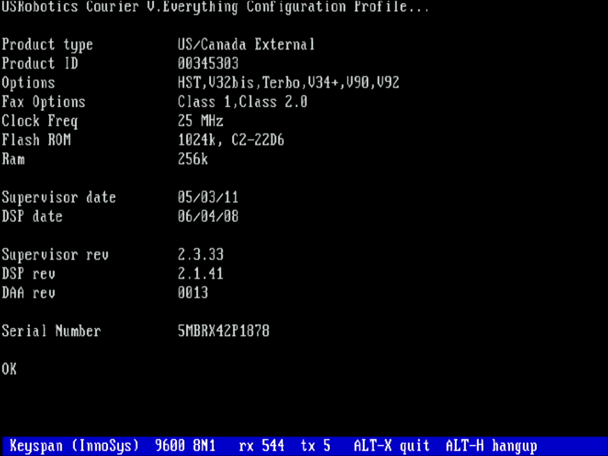
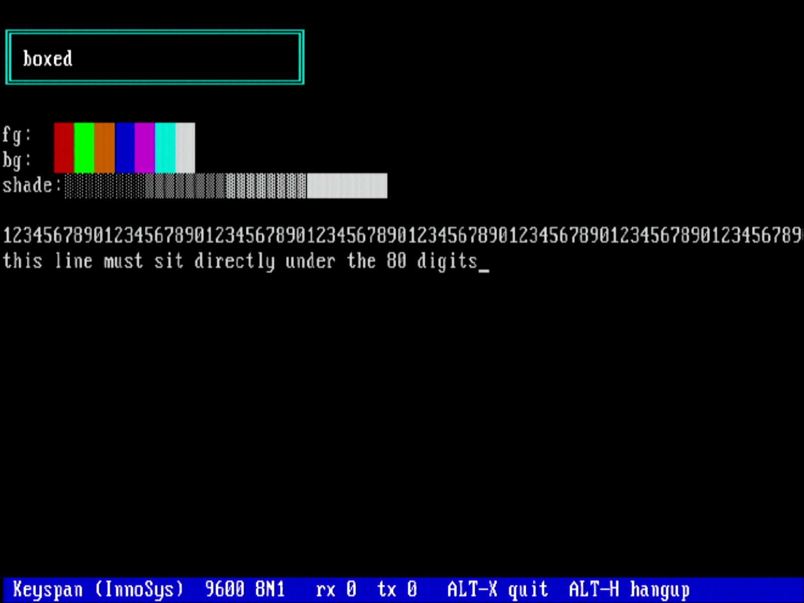

# CH375Serial

USB-to-serial adapters on a vintage DOS machine, through a CH375 USB host
card.

**Status: it works.** A DOS machine talks to a USRobotics Courier
V.Everything modem through a CH375 and a USB-to-serial adapter, at up to
**38400 baud**, with `AT` commands and multi-line replies coming back cleanly.

Unlike CH375Audio there was never an architectural reason this should fail, and
it didn't. What it cost was two DIP switches on the modem and one number: the
USB packet rate.

---

## Why this one should work

CH375Audio ended in a measured impossibility. A USB-to-serial adapter is the
opposite of a USB speaker on every count that mattered there:

| | USB audio | USB serial |
|---|---|---|
| transfer type | isochronous — no handshake | **bulk** |
| packet size | 192 bytes | **64 bytes or less** |
| rate | 192,000 B/s, hard 1 ms deadline | **11,520 B/s at 115200 baud** |
| late data | an audible click | a byte that arrives late |

Against the ~19,000 bytes/second this collection has measured, **the link is not
the limit**. Both ends buffer, which is the property that decides everything on
this bus — see the rule in the collection's [top-level README](../README.md).

---

## Which adapters are proven

| family | line setting | verified on hardware |
|---|---|---|
| **Keyspan (InnoSys)** `06CD:0121` | flat 34-byte block on its own bulk endpoint | **yes** — USR Courier at up to 38400, ANSI terminal, dial-out |
| **FTDI** `0403:6001` | four vendor requests on endpoint 0 | **yes** — `AT`/`OK` at 9600, 19200, 38400 and 115200 |
| CDC-ACM | `SET_LINE_CODING`, the standard | written, no hardware yet |
| CP210x | vendor requests | written, no hardware yet |
| PL2303, CH340/CH341 | — | recognised, not driven |

"Written" and "verified" are kept apart on purpose. `SerSupported` says
which the unit will *attempt*, and a family it merely recognises returns
False from `SerOpen` rather than pretending — because a port that was never
opened delivers nothing, and "no answer" is exactly what a wrong baud rate
looks like.

**The FTDI verification is worth more than one more row**, because it is the
first family other than the reference part and it exercised things the
Keyspan never did:

* **Transmit.** `USBMOUSE` proved FTDI *reading* at 1200 first, but a mouse
  never sends, so `SerSend` on this family was untested until the modem
  answered.
* **The fractional divisor.** FTDI holds 3,000,000/baud in eighths and
  encodes the fraction into the top bits of `wIndex` through a lookup that
  is not in numeric order. At 1200 and 9600 it comes out exact and none of
  that machinery runs. 19200 and 38400 both carry a fraction, and both
  answer.
* **The LCR is not the Keyspan's.** FTDI wants the actual bit count in the
  low bits, where the Keyspan wants the 16550 encoding — 8N1 is 8 on one and
  3 on the other. Copying one into the other gives a port that opens
  cleanly and reads garbage.

### The tools find the configuration themselves now

The default used to be configuration index 1, which is right for the Keyspan
— it declares two and only the second carries a bulk pair, the first putting
interrupt endpoints where the data should be — and wrong for every adapter
with a single configuration. An FTDI has only index 0, so the default asked
for one that does not exist and `SERTALK` and `SERTERM` failed before they
reached the adapter they were pointed at.

They now try each in turn and take the first that yields a drivable serial
adapter. `/C=` still forces one, which is what it should have been all
along: a thing to reach for when a device is unusual, not a thing you have
to know in advance.

`SERTALK` also no longer refuses anything but a Keyspan. It was written
before `dser` existed, as the experiment that reconstructed the Keyspan
control message, so it built that message itself and knew no other. The
Keyspan arm stays — printing the message field by field is the whole reason
the tool exists — and every other family goes through `SerOpen`.

## The reference adapter, and the trap it exposed

The part this was written against is a **Keyspan USA-19H** (`06CD:0121`).

```
  device              : 06CD:0121  Keyspan / InnoSys
  configurations      : 2
  selected            : index 1, value 2
      EP 01  OUT  bulk  max 64
      EP 02  OUT  bulk  max 64
      EP 03  OUT  bulk  max 64
      EP 81  IN   bulk  max 64
      EP 82  IN   bulk  max 64
```

### It has TWO configurations, and they are not interchangeable

| | EP 81 / 82 |
|---|---|
| index 0, value 1 | **interrupt** IN |
| index 1, value 2 | **bulk** IN |

Same endpoints, same numbers, same everything else — only the transfer type
differs. Both are drivable from a CH375, which does interrupt *and* bulk, but
bulk is what you want for a data pipe.

This matters beyond this one adapter. Nearly every USB device has exactly one
configuration, so nearly every driver — including the first draft of this
project's — fetches index 0 and sends its `bConfigurationValue` without ever
looking. That would have worked here, slower, for reasons that would never
appear in its own logs.

Note also that the descriptor **index** and the **bConfigurationValue** are
different numbers — 0/1 and 1/2 here — and sending the index where the value
belongs selects nothing at all. This device makes that mistake visible, which
is a good reason to keep it as the reference part.

### Four endpoints, not two

Keyspan splits the job further than most: data in and out, **plus a separate
control OUT and status IN**.

```
  data OUT            : 01  (addr 01)  max 64
  data IN             : 01  (addr 81)  max 64
  control OUT         : 02  (addr 02)
  status IN           : 02  (addr 82)
```

A driver that assumes the usual two-endpoint shape would send its line settings
down the data pipe and out of the serial port as gibberish.

---

## The USB path is proven, end to end

`SERTALK` opens the port with a reconstructed Keyspan control message and the
adapter accepts it:

```
  control msg       : 34 bytes to EP 02
  control message -> success
  STATUS  msr 33  CTS DSR  | port ENABLED | control ack 1
```

Three things in that one line are evidence rather than hope. The status
message is **exactly 14 bytes**, which is the length of the reconstructed
`usa90` status struct. `portState` bit 7 says the port is **enabled**, so the
message was acted on rather than merely accepted. And `controlResponse`
echoes the `returnStatus` we asked for.

### Adapter loopback: the data path works

With the adapter's own TX-to-RX loopback enabled — the modem, the cable and
the baud rate all out of the picture — `AT` + CR comes straight back:

```
  TX  3: 41 54 0D  |AT.|
  RX  2: 00 41  |.A|
  RX  2: 00 54  |.T|
  RX  2: 00 0D  |..|
```

So everything from the host, through the CH375, through USB, into the adapter
and back is working.

**And it caught a trap worth the whole exercise:** every bulk IN packet carries
a **one-byte header** before the data. Strip it and you get `AT
`; don't, and
you get a NUL between every character, which looks exactly like a framing or
baud-rate error and is not. This is Keyspan's equivalent of FTDI's two status
bytes — and unlike the FTDI note, this one is *measured here* rather than
recalled.

### It talks to a real modem

A USRobotics Courier V.Everything, over the adapter, from DOS:

```
  TX  5: 41 54 49 37 0D  |ATI7.|
  < ATI7
  < USRobotics Courier V.Everything Configuration Profile...
  < Product type           US/Canada External
  < Product ID             00345303
  < Options                HST,V32bis,Terbo,V34+,V90,V92
  < Flash ROM              1024k, C2-22D6
  < Serial Number          5MBRX42P1878
  < OK
```

That is the whole chain: the host, a CH375, USB, a Keyspan adapter, RS-232, and
a modem answering.

### Dialling: the modem works, the line does not

`SERTALK /D=<number>` dials, listens, and **always hangs up** — dial, listen
and `ATH` are one unbroken sequence with the hang-up on every path out,
including the early ones. A modem that has gone off-hook stays off-hook, and a
program that exits without releasing the line leaves it seized until somebody
power-cycles the modem.

Against a VOIP adapter, every attempt came back the same way:

```
  > ATDT8594093505
  < NO DIAL TONE
```

That is the modem talking, and talking correctly — the whole command path
works, the echo comes back, `ATH` returns `OK`, the line releases. What it
cannot find is a dial tone.

The usual software answer is to dial blind: `ATX3` (no dial-tone wait, busy
detection kept) and then `ATX0` (the most permissive setting there is, which
should not be able to emit that result code at all). **Both still reported NO
DIAL TONE**, which is the useful part of the result: when the most permissive
setting still refuses, the modem is not being fussy about an unfamiliar VOIP
tone — it is not seizing the line at all.

So the remaining causes are all on the line side, and none can be told apart
from the DOS end:

* **The wrong jack.** A Courier has both `LINE` and `PHONE` sockets and they
  look identical. The cable must be in `LINE`.
* **The ATA port is not live.** The decisive test takes ten seconds: plug an
  ordinary telephone into the same socket and listen for dial tone.
* **The ATA is not registered** with its provider, so the port is dead even
  though the box is powered.

`ATX3` is what ships, because blind dialling with busy detection is the right
default for a VOIP line even though it did not rescue this one.

### The packet rate is the limit, and it sets the baud ceiling

The first long reply came back shredded — characters torn and NULs interleaved,
which reads exactly like a baud-rate or framing fault and is neither. The cause
is a number this project already knew.

`rxForwardingLength` was 1, meaning *forward the instant a byte arrives*. That
is the lowest latency and what a terminal wants, but at 9600 baud it is **960
USB packets per second**, and 9600 is the slow setting. This CH375 manages a
few hundred: CH375Audio measured **131–138 packets/s** for 64-byte bulk
transfers. The adapter was producing packets several times faster than the host
could collect them.

The fix comes from the right end — batch. Ask the adapter for whole mouthfuls
instead of single bytes and the *packet* rate falls by the batch factor while
the *byte* rate is unchanged. `rxForwardingTimeout` keeps it responsive: a short
reply that never reaches the batch size is forwarded anyway after 16 ms, so
`OK` does not sit waiting for 31 characters that will never come.

With 32-character batching:

| baud | bytes/s | packets/s at batch 32 | result |
|---|---|---|---|
| 9600 | 960 | 30 | **clean** |
| 38400 | 3,840 | 120 | **clean** |
| 57600 | 5,760 | 180 | **marginal** — starts clean, tears partway through a long reply |
| 115200 | 11,520 | 360 | **unusable** |

**38400 baud is the reliable ceiling**, and it lands exactly where the measured
packet limit predicts: 120 packets/s against ~130–138 available. 57600 needs
180 and degrades once a reply runs long enough to fill the buffer. Raising the
batch to 64 did not rescue 115200 and introduced its own corruption, so 32 is
the setting that ships.

That is a satisfying place to end up: the constraint is not the baud rate, the
UART, or the adapter — it is the same USB packet-rate ceiling that decided the
video project's frame rate and killed the audio one. One number explains all
three.

### What it took to get the modem talking

The modem was silent at first, at every baud rate, while asserting CTS and DSR.
Two things were wrong, both at the modem end:

* **DIP switch 1** was at its default, *DTR Normal* — the modem requires DTR.
  Setting it to *Ignore DTR* removes any dependency on that line being wired
  through the cable.
* **DIP switch 10** was at its default, *load the configuration stored in
  NVRAM*. Setting it to *load `&F0` from ROM* overrides whatever was saved
  there — including an `ATE0Q1` that would make the modem obey commands
  silently.

Switches on a Courier are read **only at power-on**, so they do nothing until
the modem is switched off and on.

A note on getting this right: the switch table for the 8-switch Sportster is
**not** the table for the 10-switch Courier, and several positions are
inverted between them. On this modem `ON` means `DOWN`. The authoritative
table is USR's own, and it is printed on the unit.

### The modem-line test, and what it ruled out

Before the DIP switches were touched, `CTS` and `DSR` read asserted while
nothing answered. The obvious suspicion was a **crossover/null-modem cable**,
where RTS loops back to CTS and DTR to DSR, so a disconnected adapter mimics a
live modem. `SERTALK /M` drives both outputs through all four combinations and
reads the inputs back:

| RTS / DTR | CTS / DSR read back |
|---|---|
| 0 / 0 | CTS DSR |
| 1 / 0 | CTS DSR |
| 0 / 1 | CTS DSR |
| 1 / 1 | CTS DSR |

They do not track, so the lines were not looped — the far end really was
holding them up, and the cable was never the problem. Worth keeping: it is a
two-minute test that eliminates an entire class of wiring fault.

## What is verified, and what is not

| | |
|---|---|
| Enumeration over CH375 | **verified** |
| Both configurations read and decoded | **verified** |
| Selecting the bulk configuration | **verified** |
| Endpoint map | **verified** |
| Status pipe behaviour with an idle port | **verified** — steady NAK (42), 4487 of them in 5 s |
| Keyspan control message (port open, baud, LCR, RTS/DTR) | **works** — port reports ENABLED |
| Status message decode (CTS/DSR/DCD/RI, port state) | **works** |
| Sending and receiving serial data | **works in adapter loopback** |
| The one-byte RX packet header | **measured** |
| Talking to a USR Courier V.Everything | **works** — `AT` → `OK`, `ATI7` → full profile |
| Reliable baud ceiling | **38400** measured; 57600 marginal, 115200 unusable |
| RX batching to stay under the packet ceiling | **measured** — 32 chars/packet |

A steady NAK on the status pipe is the *correct* answer for a port that has not
been opened: the adapter has nothing to report until it has been configured
over the control endpoint. It is not evidence of a fault, and `SERPROBE` says
so rather than implying otherwise.

**Nothing here can tell you whether anything is plugged into the serial end.**
With an empty port a healthy adapter and a dead one look identical: the data
pipe NAKs either way.

---

## The honest problem: Keyspan's protocol is private

Only **CDC-ACM** is a real standard. Everything else — FTDI, Prolific, WCH,
Silicon Labs, Keyspan — is a private vendor protocol reached through control
transfers or a control endpoint, and they disagree about everything: how a baud
rate is encoded, whether line settings are one message or three, and in FTDI's
case whether the data stream contains only data.

Keyspan is at the difficult end of that range. Its message format is not
published; what is known publicly comes from the Linux `keyspan` driver, and
reproducing it from memory of that driver is exactly the kind of guessing this
collection tries not to do. So the line-setting path is **written as
unimplemented rather than written as a guess**, and `SERPROBE` reports the
family as *recognised but not driven*.

**If the goal is a working serial port sooner rather than later, a cheap
CH340, CP2102, FTDI or CDC-ACM adapter is a far better target** — those are
documented, and the code for them can be written with confidence instead of
reverse-engineered. The Keyspan remains the better *test* part, because its
two-configuration layout catches driver bugs that a simple adapter never
would.

One thing in its favour: `06CD:0121` is the Keyspan USA-19HS product ID, which
in the Linux driver's table is a **working** ID rather than a pre-firmware one
— so this adapter should not need a firmware download before it will talk.
That is an inference from the ID table, not something measured here.

---

## SERTERM: an ANSI terminal

```
SERTERM [/P=260] [/C=n] [/B=9600] [/7|/8] [/E|/O] [/2]
        [/F=n] [/L] [/I=cmd] [/D=num] [/S=secs] [/Q]

  ALT-X quit    ALT-H hang up    ALT-C clear
```

A real terminal, holding the port open: keyboard at one end, screen at the
other. `SERTALK` sends one command per run and re-enumerates the bus each
time, which makes a conversation impossible; this is what turns the adapter
from a proven thing into a usable one.



Three things in it are worth knowing.

**It is the only program here that writes straight to video memory.**
Everything else prints through DOS so the bridge can capture it. A terminal
cannot — it needs the cursor anywhere on screen, in any colour, without
scrolling the display. So it writes to `B800` directly and the bridge sees
nothing, which is why it prints a DOS summary on the way out; otherwise a run
over the bridge returns an empty log and looks like a program that never
started.

**Mono is probed, not assumed.** Some video cards boot to mono
on some power cycles and colour on others with no configuration change, so the
segment and the attributes are decided at run time from `INT 10h AH=1Ah`. A
terminal that hardcodes `B800` writes into nothing on those boots and looks
hung. On mono it uses bright and reverse rather than a colour ramp, because the
monitor sums the guns and two different colours land on the same grey.

**ANSI colour order is not the PC's.** `0,4,2,6,1,5,3,7` — red and blue are
swapped. Getting that wrong gives you a BBS that is readable but wrong, which
is the hardest kind of bug to notice.

### ANSI graphics

Yes — run `SERTERM /A` to draw the built-in test pattern:



CP437 line-drawing and shading characters, colour in the correct order, and an
exactly-80-column row with the next line directly beneath it.

| | |
|---|---|
| cursor | `CUU CUD CUF CUB` `CUP HVP` `CNL CPL` `CHA VPA` `SCP RCP` `DECSC DECRC` |
| erase | `ED` `EL` `ECH` |
| editing | `IL` `DL` `ICH` `DCH` `SU` `SD` |
| colour | `SGR` 0,1,5,7,22,25,27, 30–37, 40–47, and aixterm 90–97 / 100–107 |
| modes | `DECAWM` (`?7h/l`) `DECTCEM` (`?25h/l`) |
| reports | `DSR` (`6n`, `5n`) and `DA` (`c`) |
| characters | **full CP437** — 128–255 pass straight through to video memory |

**Answering `ESC[6n` matters more than it looks.** A BBS asks it to find out
whether there is a terminal at the other end, and sends plain ASCII to anything
that stays quiet. A terminal that ignores that one sequence never gets shown any
ANSI art at all.

**`/K` turns the blink bit into a bright-background bit** (`INT 10h AX=1003h`),
which is what most ANSI art was actually drawn for — sixteen background colours
rather than eight and a flash. It is off by default because it is global video
state that outlives the program, and silently changing how the whole machine
renders text afterwards would be rude.

Not implemented: scroll regions (`DECSTBM`), mouse reporting, and 256-colour
SGR — none of which classic ANSI art uses.

#### Deferred wrap is the one that breaks pictures

Writing the 80th character must **not** move to the next line. The cursor parks
on column 79 with a wrap *pending*, and the break only happens if another
printable character actually arrives. Wrapping eagerly puts a blank row after
every full line, so art drawn exactly 80 columns wide comes out double-spaced
and twice the height. It is the single most common way ANSI renders wrong, and
this terminal got it wrong until the test pattern above caught it.

#### Testing a renderer with no BBS to connect to

`/A` needs no modem, no line and no timing: the renderer is a pure function from
a byte stream to a screen, so feeding it a known stream and dumping the result
with `/V` tests exactly the code in question. The dump's own first version
mapped everything outside plain ASCII to a space and duly reported the
box-drawing and shading rows as **blank** — the tool filtering away the one
thing it existed to check. High bytes now show as `#`, so their presence and
position are visible even in a captured text file.

### Two bugs the screen found that no counter would have

**The status line was being scrolled away.** It lives on the last row, but the
terminal was using all 25 rows for text — so the moment output reached the
bottom, `NewLine` put the cursor on the status row, `ScrollUp` dragged the
status line up into the conversation, and a clear-screen wiped it. Because the
status line is redrawn once a tick it flickered back rather than simply
vanishing, which made it look like a drawing fault instead of a geometry one.
The text area is now `ROWS - 1` and every clear, scroll and cursor clamp agrees
where the text ends.

**Scrolling was slow enough to drop serial data.** `ScrollUp` was a Pascal loop
over `MemW[]`, and every `MemW[]` access reloads a far pointer — `BENCH`
measures about 58,640 a second on a period host. A scroll is 1920 reads plus
1920 writes, so roughly **65 ms during which the program is not reading the USB
port at all**. At 9600 baud that is sixty-odd characters, more than a whole
packet, and the lost bytes included line feeds — so the symptom was lines
overwriting each other rather than obviously missing text, which is far harder
to read as data loss:

```
 5|xternalics Courier V.Everything Configuration Profile...
 7|Options       HST,V32bis,Terbo,V3lock Freq       25 MHz
```

`REP MOVSW` beats per-element `MemW[]` by about 7.4x, measured — the same
lesson that doubled the bouncing-ball frame rate in the graphics work, arriving
here from a completely different direction. **A terminal is a real-time program
even though nothing about it looks like one:** time spent painting is time not
spent draining a buffer that keeps filling.

The batch size was the other half. `SerBatchFor` originally aimed for ~110
packets/s against a measured ceiling of 131–138, which left no headroom for any
moment the host spent not reading. It now aims for about **30 packets/s** —
`baud/300`, giving 32 characters a packet at 9600, which is exactly what
`SERTALK` used when its output was clean.

### Testing a program the bridge cannot see

`/V` prints the finished screen back through DOS. A terminal draws into video
memory, which the bridge cannot capture, so the only way to check it was to
photograph the screen and guess when to press the shutter — three attempts in a
row caught the wrong moment and said nothing about the program. Dumping the
text plane at exit is deterministic and needs no camera:

```
 3|USRobotics Courier V.Everything Configuration Profile...
 5|Product type           US/Canada External
 6|Product ID             00345303
status| Keyspan (InnoSys)  9600 8N1   rx 2176  tx 20   ALT-X quit  ALT-H hangup|
```

Its own first version set video mode 3 before reading — which *clears the
screen* — and faithfully reported 25 blank rows after a session that had
received 2087 bytes. The mode reset now happens after the bytes are read.

`/R=n` repeats the opening command, which exists purely to force a scroll: a
single `ATI7` is sixteen lines and never reaches the bottom of a 24-row window,
so it could never have shown the status line being overwritten.

`/S=secs` exists so the thing can be tested at all: a terminal quits on a
keystroke and the bridge has no keyboard, so without it an unattended run
blocks until somebody walks to the machine.

## Several adapters, one interface

`dser` identifies the chipset family and then dispatches, because only CDC-ACM
is a standard and the rest are private vendor protocols that agree about
nothing — not how a baud rate is encoded, not whether line settings are one
message or three, not even whether the data stream contains only data.

| family | line settings | notes |
|---|---|---|
| **Keyspan** | **works, verified** | 34-byte control message on its own endpoint; **1 status byte** per RX packet |
| **CDC-ACM** | written, untested | the only published standard; baud is simply the baud rate |
| **FTDI** | written, untested | divisor is `3000000/baud` in eighths, fraction encoded into `wIndex`; **2 status bytes** per RX packet |
| **CP210x** | written, untested | vendor requests, plain 32-bit baud |
| CH340 / PL2303 | recognised only | detected and reported; no line-setting path yet |

Only Keyspan has been exercised against hardware. The other three are written
from their published protocols and are marked untested rather than claimed to
work — `SERPROBE` will say which family it found, and `SERTERM` refuses rather
than guessing if the family has no path.

The per-packet header is the trap that generalises: FTDI puts **two** status
bytes at the head of every bulk IN packet and Keyspan puts **one**, so `SerRecv`
strips `StatusHdr` and returns the count of real data bytes. Skip it and you
get rubbish interleaved with your data, and you blame the baud rate.

## The tools

### `SERPROBE` — identify the adapter

```
SERPROBE [/P=260] [/C=n] [/S=secs] [/E=n] [/V] [/T]

  /C=n     configuration INDEX to select, default 0
  /S=secs  poll an IN endpoint and print whatever arrives, raw
  /E=n     which endpoint to poll (default: the status pipe)
```

Read-only: it selects a configuration and reads descriptors, and sends no data.
`/S` is how to watch a status pipe — on a part that has one it reports the
modem lines, and it should change when a cable is finally attached, which is
the experiment worth running once there is something to plug in.

---

## Building

```
build.cmd            build only
build.cmd probe      ...then identify the attached adapter
build.cmd bulk       ...select the bulk configuration and report
build.cmd watch      ...and poll the status pipe for 20 seconds
```

Needs Free Pascal cross-compiling to real-mode DOS (`-Tmsdos -Pi8086`). The
CH375 layer is `ch375.pas` from `..\CH375USBTOOLS\src`, found with `-Fu`.

### `dser.pas`

Family detection and the bring-up. One ordering detail in it was learned here
and is worth repeating, because it is subtle and it bit twice:

**`SET_RETRY 00` must come after every control transfer of the bring-up, and
before any endpoint is polled.** `BusUp` arms `SET_RETRY 8F` — retry NAKs
forever — which is right while enumerating and catastrophic afterwards, since
an idle adapter NAKs its bulk IN constantly and the chip will grind on that
until it stops answering anything at all. But putting it *early* is just as
wrong: a device that NAKs one control transfer while preparing a response then
fails on the first ask. This adapter has an 8-byte control endpoint, so its
descriptors take many round trips and it NAKs during them — it failed
immediately with `cannot read the configuration header (NAK)` until the call
moved to the end. CH375Audio's speaker answered fast enough to hide the same
bug.

---

## Where this sits in the collection

| project | |
|---|---|
| [CH375USBTOOLS](../CH375USBTOOLS) | the shared CH375 layer and the generic probes |
| [CH375Keyboard](../CH375Keyboard) | USB keyboards |
| [CH375Mouse](../CH375Mouse) | USB mice |
| [CH375Net](../CH375Net) | USB Ethernet |
| [CH375Video](../CH375Video) | USB display adapters |
| [CH375Audio](../CH375Audio) | USB audio: the mixer and the buttons, not the sound |
| **CH375Serial** | USB-to-serial: identified, not yet driven |

---

Public domain (the Unlicense); see [LICENSE](../LICENSE).
